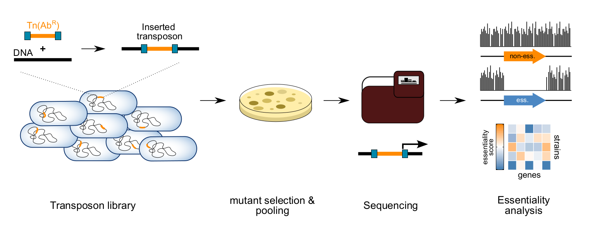

# Analysis to Ghomi et al. 2024

- Name of project: High-throughput transposon mutagenesis in the family Enterobacteriaceae reveals core essential genes 
and rapid turnover of essentiality
- Paper link to biorxiv: https://journals.asm.org/doi/full/10.1128/mbio.01798-24
- Authors: Fatemeh A. Ghomi, Jakob J. Jung, Gemma C. Langridge, Amy K. Cain, Christine Boinett, Moataz Abd El Ghany, 
Derek J. Pickard, Robert A. Kingsley, Nicholas R. Thomson, Julian Parkhill, Paul P. Gardner, Lars Barquist
- Status: in preparation (2024)

## Introduction
This project cotains the analysis of high-throughput transposon mutagenesis in the family Enterobacteriaceae. The 
project was set up to se differences in gene essentiality between different species of Enterobacteriaceae. Experiments
Include Transposon Directed Insertion-site Sequencing (TraDIS) in several species, as summarised below:



## Prerequisites
For running the analysis, the following programs are needed:
* Phylosift
* Hieranoid (v2)
* RaxML (v8.0.0)
* Weblogo (v3)
* PastML v1.9.42
* Python 3 and several libraries (see the Python scripts)
* R and several libraries (see the R scripts)


Below, the steps for different analyses in the manuscript are explained.

## 1. Generate phylogenetic tree
Generate a phylogenetic tree using:
```bash
cd results/phylosift
find ../../data/fasta-genome/chromosome/ -maxdepth 1 -name "*.fa" -exec ~/program-bank/phylosift_v1.0.1/phylosift search --isolate --besthit {} \;
find ../../data/fasta-genome/chromosome/ -maxdepth 1 -name "*.fa" -exec ~/program-bank/phylosift_v1.0.1/phylosift align --isolate --besthit {} \;
for f in PS_temp/*/alignDir/concat.updated.1.fasta; do cat "$f" >> protein_alignment.fa; done
raxmlHPC -s protein_alignment.fa -n phylosift-aa.raxmlbootstrap -m PROTGAMMALG4M -p 1234 -f a -x 1234 -# 100
```

## 2. Cluster orthologous proteins
* Run hieranoid with BLAST as its similarity search tool on the proteins in data/fasta-protein/chromosome using the tree 
in results/phylosift/RAxML_bestTree.phylosift-aa.raxmlbootstrap rooted at midpoint. The output of the program is saved 
in the results/hieranoid folder
* Convert the output to a file that is easy to read for other programs in this analysis by running edit-hieranoid.py

## 3. Calculate insertion index
* Run calculate-insertion-index.R to calculate insertion index for trimmed genes on both 5' and 3' sides.
* Run calculate-insertion-index_not-trimmed.R to calculate insertion index for untrimmed genes.
* The outputs are saved in results/insertion-indices

## 4. Benchmark the methods of essentiality evaluation (revision)
* ecogene-k12.txt in results directory contains list of E.coli K-12 essential genes from ecogenes.
* Run find-k12-counterparts.py
* The results of Monte Carlo method (Turner, K.H., Wessel, A.K., Palmer, G.C., Murray, J.L., and Whiteley, M. (2015). Essential genome of Pseudomonas aeruginosa in cystic fibrosis sputum. PNAS 112, 4110–4115.) are saved in results/Tn-seq
* Run benchmark-essentiality-calls.R. The results are saved in figures/essential-call-comparison-*.pdf and in figures/roc_table.pdf

## 5. STUDY BIASES
### 5.1. Nucleotide composition bias
* Run make-logos-top-100.py to prepare data for making logos from 100 insertion sites with the highest number of insertions.
* Generate logos:
    ```bash
    cd results/logos
    cd weblogo -F pdf -A dna -f 100logos.txt -o ../../figures/100logo-prob.pdf -s large -U probability
    cd weblogo -F pdf -A dna -f 100logos.txt -o ../../figures/100logo-bits.pdf -s large --composition "{'A':23, 'C':27, 'G':27, 'T':23}"
    ```
### 5.2. Position bias within genes
* Run insertion-position-bias.py followed by insertion-position-bias.R. The output figure is saved in figures/insertion-position-bias.pdf

### 5.3. G-C and distance from origin biases
* Run check-biases.py, the output is saved in results/biases/check-biases
* Run check-biases_not-trimmed.py to check the biases on the genes that are not trimmed on the two ends. The results are saved in results/biases/check-biases_not-trimmed

### 5.4. Correct biases
* Run check-biases-ii.R to correct the biases. The code saves the corrected insertion indices in results/biases/dbscan and visualises different biases in figures/biases.pdf
* Run compare-bias-predictions.R to compare the impact of bias corrections. The output figure is saved in figures/compare-bias-predictions.pdf

## 6. DBSCAN better clusters essential and non-essential genes compared to gamma fit
* Run compare-dbscan-gamma.R. The resulting figure is saved in figures/gamma-vs-dbscan.pdf

## 7. Find ideal insertion density
* Run density-SL1344.R. The output is saved in false-positive-rate_density.pdf.

## Ancestrally essential genes
* To find ancestrally essential genes using fitch algorithm, run define-core-accessory-hieranoid-fitch.py. The outputs 
are saved in results/define-core-accessory-hieranoid-fitch*

## 8. Core essential genes for TraDIS, DEG and endosymbionts
### 8.1. Generate phylogenetic tree

```bash
cd EnTrI/results/all-hieranoid/
find fasta-genome/ -maxdepth 1 -name "*.fa*" -exec ~/program-bank/phylosift_v1.0.1/phylosift search --isolate --besthit {} \;
find fasta-genome/ -maxdepth 1 -name "*.fa*" -exec ~/program-bank/phylosift_v1.0.1/phylosift align --isolate --besthit {} \;
for f in PS_temp/*/alignDir/concat.updated.1.fasta; do cat "$f" >> protein_alignment.fa; done
raxmlHPC -s protein_alignment.fa -n phylosift-aa.raxmlbootstrap -m PROTGAMMALG4M -p 1234 -f a -x 1234 -# 100
```


### 8.2. Cluster orthologous proteins
* Run hieranoid with BLAST as its similarity search tool on the proteins in data/fasta-protein/chromosome using the tree 
in results/phylosift/RAxML_bestTree.phylosift-aa.raxmlbootstrap rooted at midpoint. The output of the program is in 
results/all-hieranoid/hieranoid-result.txt
* Convert the output to a file that is easy to read for other programs in this analysis by running edit-hieranoid.py

### 8.3. Generate tables and figures summarising essentiality
* Run annotate-clust.py. The output is saved in results/all-hieranoid/cluster-representatives.txt
* Run eggnog-mapper on cluster-representatives.txt to find gene names for clusters.
* Download KEGG annotations and save them in results/KEGG
* Run giant-tab-1.py
* Run giant-tab-2.R
* Run venn-ancestral-core-endosymbiont.R

## 9. Do additional analyses (revision)
* run additional_plots.R to generate additional plots, analyses (e.g. the PastML analysis), and the final table in 
data/final_table_JJ.tsv . for running PastML, we additionally had to run the bash commands: 
  ```bash
  cd data/pastml_reconstruction
  pastml --tree phylosift-aa-without-enterobacter.raxmlbootstrap.tre --data table_only_ess_genes.tsv --data_sep "\t" -v \
  -o pastml_ess_genes_nonconserved.txt --html_compressed pastml_ess_genes_nonconserved.html
  
  pastml --tree phylosift-aa-without-enterobacter.raxmlbootstrap.tre --data all_genomes_nonconserved.tsv --data_sep "\t"\ 
  -v -o pastml_all_genomes_nonconserved.txt --html_compressed pastml_all_genomes_nonconserved.html
  ```

## 10. Do additional statistical tests (revision)
* Run additional_stat_tests.R to perform additional statistical tests (e.g. the permutation test). Figures are saved
in the figures directory.
